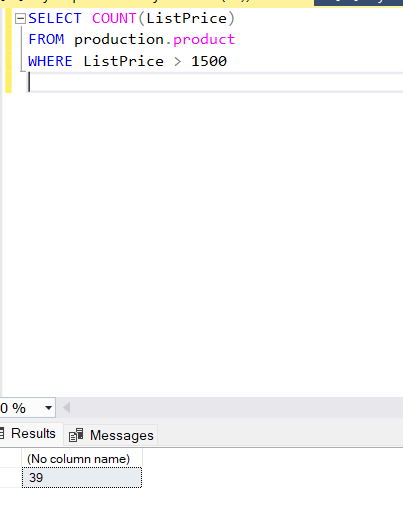
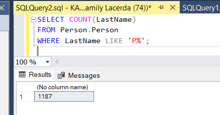
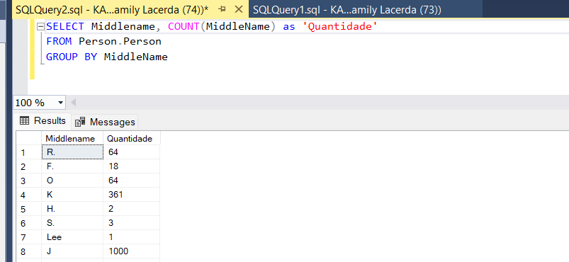
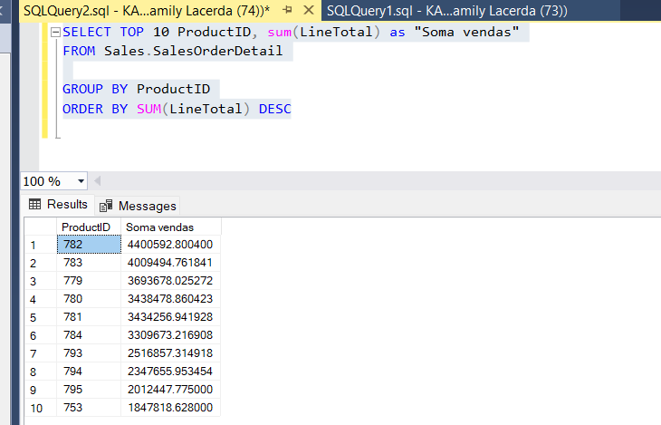

# Desáfio 1: # 

A EQUIPE DE MARKETING PRECISA DE FAZER UMA PERSQUISA SOBRE NOMES MAIS COMUNS DE SEUS CLIENTES E PRECISA DO NOME E SOBRENOME DE TODOS OS CLIENTES QUE ESTAO CADASTRADOS NO SISTEMA.

***Resposta:***

-----------------------------------------------------
-----------------------------------------------------
# Desáfio 2: # 
QUANTOS NOMES SOBRENOMES UNICOS TEMOS EM NOSSA TABELA PERSON.PERSON?

***Resposta:***

-----------------------------------------------------

# Desáfio 3: # 

A equipe de produção de produtos precisa do nome de todas as peças que pesam mais que 500kg mas não
mais que 700kg para inspeção.

***Resposta:***

-----------------------------------------------------

# Desáfio 4: 
Foi pedido pelo marketing um relação de todos os empregados(employees) que sao casados
( married =casado) e são asalariados(salaried)

***Resposta:***

-----------------------------------------------------

# Desáfio 5:

Um usuario, chamado Peter Crabs esta devendo um pagamento,consiga o email dele para que possamos enviar uma cobranca voce vai ter que usar prson.person e depois a tabela person.emailaddress

***Resposta:***

-----------------------------------------------------

# Desáfio 6:
 Quantos produtos temos cadastrado no sistema que custam mais que 1500 dolares?

-----------------------------------------------------

# Desáfio 7:
 Quantas pessoas temos com sobrenome que incia com a letra P?
 

-----------------------------------------------------

# Desáfio 8:

EU PRECISO SABER QUANTAS PESSOAS TEM O MESMO MIDDLENAME E AGRUPAR AS MESMAS

***Resposta:***

-----------------------------------------------------
# Desáfio 9:

Eu quero saber qual foram as 10 vendas que no total tiveram os maiores valores
de venda(line total) por produto do maior valor para o menor

***Resposta:***

-----------------------------------------------------