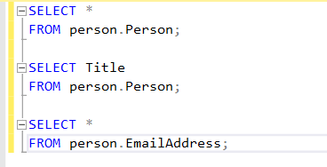

# 🚀 **SQL Server** ✨  


`SELECT`
-- SQL Server, Postgres, Oracle, mySql

|`SELECT coluna1, coluna2 FROM tabela`

`SELECT *` -> significa seleionar todas as colunas da tabela
`FROM tabela`



-----------------------------------------------------


`SELECT DISTINCT` coluna1, coluna2 
`FROM` tabela -> Distinct elimina valores duplicados em uma consulta, retornando apenas valores únicos de uma coluna ou combinação de colunas. 

-----------------------------------------------------


# **Operadores utilizados com WHERE no SQL**

A cláusula **WHERE** no SQL é usada para filtrar os registros de uma tabela com base em condições específicas. Abaixo estão os operadores mais comuns e como utilizá-los.


## **1. Operadores de Comparação**
São usados para comparar valores.

| Operador | Descrição               | Exemplo                                                                 |
|----------|-------------------------|-------------------------------------------------------------------------|
| `=`      | Igual                   | `SELECT * FROM Clientes WHERE Cidade = 'São Paulo';`                  |
| `!=` ou `<>` | Diferente           | `SELECT * FROM Clientes WHERE Idade != 30;`                           |
| `>`      | Maior que               | `SELECT * FROM Produtos WHERE Preco > 50;`                            |
| `<`      | Menor que               | `SELECT * FROM Produtos WHERE Preco < 50;`                            |
| `>=`     | Maior ou igual          | `SELECT * FROM Produtos WHERE Preco >= 50;`                           |
| `<=`     | Menor ou igual          | `SELECT * FROM Produtos WHERE Preco <= 50;`                           |

---

## **2. Operadores Lógicos**
São usados para combinar condições.

| Operador | Descrição               | Exemplo                                                                 |
|----------|-------------------------|-------------------------------------------------------------------------|
| `AND`    | Todas as condições devem ser verdadeiras | `SELECT * FROM Clientes WHERE Cidade = 'São Paulo' AND Idade > 30;` |
| `OR`     | Pelo menos uma condição deve ser verdadeira | `SELECT * FROM Clientes WHERE Cidade = 'São Paulo' OR Cidade = 'Rio';` |
| `NOT`    | Inverte a condição      | `SELECT * FROM Clientes WHERE NOT Cidade = 'São Paulo';`               |

---

## **3. Operadores de Intervalo**
Trabalham com intervalos de valores.

| Operador | Descrição               | Exemplo                                                                 |
|----------|-------------------------|-------------------------------------------------------------------------|
| `BETWEEN` | Dentro de um intervalo (inclusivo) | `SELECT * FROM Produtos WHERE Preco BETWEEN 10 AND 50;`               |
| `NOT BETWEEN` | Fora de um intervalo | `SELECT * FROM Produtos WHERE Preco NOT BETWEEN 10 AND 50;`           |

---

## **4. Operadores de Conjunto**
Trabalham com listas ou conjuntos de valores.

| Operador | Descrição               | Exemplo                                                                 |
|----------|-------------------------|-------------------------------------------------------------------------|
| `IN`     | Igual a qualquer valor da lista | `SELECT * FROM Clientes WHERE Cidade IN ('São Paulo', 'Rio', 'Salvador');` |
| `NOT IN` | Não igual a nenhum valor da lista | `SELECT * FROM Clientes WHERE Cidade NOT IN ('São Paulo', 'Rio');`     |

---

## **5. Operadores de Padrão (LIKE e NOT LIKE)**
Usados para pesquisar padrões em texto.

| Operador | Descrição               | Exemplo                                                                 |
|----------|-------------------------|-------------------------------------------------------------------------|
| `LIKE`   | Pesquisa por um padrão  | `SELECT * FROM Clientes WHERE Nome LIKE 'A%';` *(começa com 'A')*      |
| `NOT LIKE` | Não corresponde ao padrão | `SELECT * FROM Clientes WHERE Nome NOT LIKE '%o';` *(não termina com 'o')* |
| **Caracteres Coringa** | | |
| `%`      | Qualquer sequência de caracteres | `SELECT * FROM Clientes WHERE Nome LIKE '%Silva%';` *(contém 'Silva')* |
| `_`      | Um único caractere      | `SELECT * FROM Clientes WHERE Nome LIKE 'A_a';` *(ex: Ana, Aba)*       |

---

## **6. Operadores Nulos**
Filtram registros com valores nulos.

| Operador | Descrição               | Exemplo                                                                 |
|----------|-------------------------|-------------------------------------------------------------------------|
| `IS NULL` | Verifica se o valor é nulo | `SELECT * FROM Clientes WHERE Telefone IS NULL;`                       |
| `IS NOT NULL` | Verifica se o valor não é nulo | `SELECT * FROM Clientes WHERE Telefone IS NOT NULL;`                   |

---

## **7. Operadores de Comparação Avançados**
São usados em situações específicas.

| Operador | Descrição               | Exemplo                                                                 |
|----------|-------------------------|-------------------------------------------------------------------------|
| `EXISTS` | Verifica se um subquery retorna resultados | `SELECT * FROM Clientes WHERE EXISTS (SELECT 1 FROM Vendas WHERE Clientes.ID = Vendas.ClienteID);` |
| `ANY`    | Compara se algum valor da subquery atende à condição | `SELECT * FROM Produtos WHERE Preco > ANY (SELECT Preco FROM Descontos);` |
| `ALL`    | Compara se todos os valores da subquery atendem à condição | `SELECT * FROM Produtos WHERE Preco > ALL (SELECT Preco FROM Descontos);` |

---

## **8. Exemplos Combinando Operadores**

### **Exemplo 1:**
Selecionar clientes com idade entre 20 e 30 anos que moram em São Paulo ou Rio de Janeiro:
```sql
SELECT * 
FROM Clientes 
WHERE (Idade BETWEEN 20 AND 30) AND Cidade IN ('São Paulo', 'Rio de Janeiro');
```

# Função COUNT em SQL

A função `COUNT` é uma função agregada usada para contar o número de linhas em um conjunto de dados. É útil quando você deseja saber quantos registros existem em uma tabela ou em uma consulta que atenda a um critério específico.

## Sintaxe

```sql
COUNT([DISTINCT] expressão)
```

# Comando TOP em SQL

O comando `TOP` é usado para limitar o número de registros retornados por uma consulta. Ele é útil quando você deseja recuperar apenas uma quantidade específica de resultados, como os primeiros ou os últimos registros de uma tabela.

## Sintaxe

```sql
SELECT TOP (n) coluna1, coluna2, ...
FROM tabela;
```
# Comando ORDER BY em SQL

O comando `ORDER BY` é utilizado para ordenar os resultados de uma consulta de acordo com uma ou mais colunas. Ele pode ser usado em conjunto com a cláusula `SELECT` para retornar os registros ordenados de forma crescente ou decrescente.

## Sintaxe

```sql
SELECT coluna1, coluna2, ...
FROM tabela
ORDER BY coluna1 [ASC|DESC], coluna2 [ASC|DESC], ...;
```
# Operador BETWEEN em SQL

O operador `BETWEEN` é utilizado para filtrar resultados com base em um intervalo de valores. Ele pode ser aplicado tanto para valores numéricos, como para datas e texto. O operador `BETWEEN` retorna os registros cujos valores estão dentro do intervalo especificado, incluindo os valores de início e fim do intervalo.

## Sintaxe

```sql
SELECT coluna1, coluna2, ...
FROM tabela
WHERE coluna BETWEEN valor_inicial AND valor_final;
```

# Operador NOT IN em SQL

O operador `NOT IN` é utilizado para filtrar resultados que **não** correspondem a nenhum dos valores fornecidos em uma lista. Ele é a versão oposta do operador `IN`, que seleciona valores que correspondem aos valores especificados. `NOT IN` é útil quando você deseja excluir certos valores de uma consulta.

## Sintaxe

```sql
SELECT coluna1, coluna2, ...
FROM tabela
WHERE coluna NOT IN (valor1, valor2, valor3, ...);
